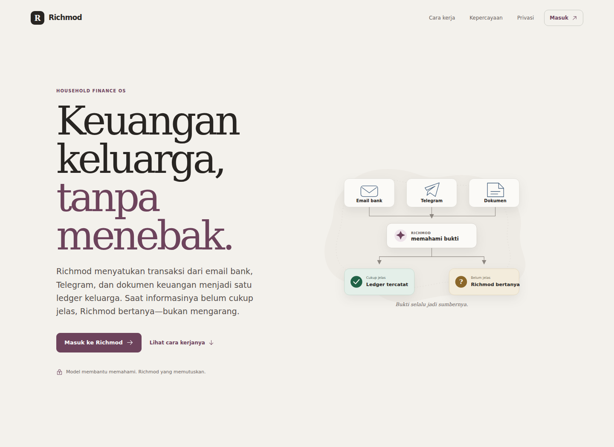
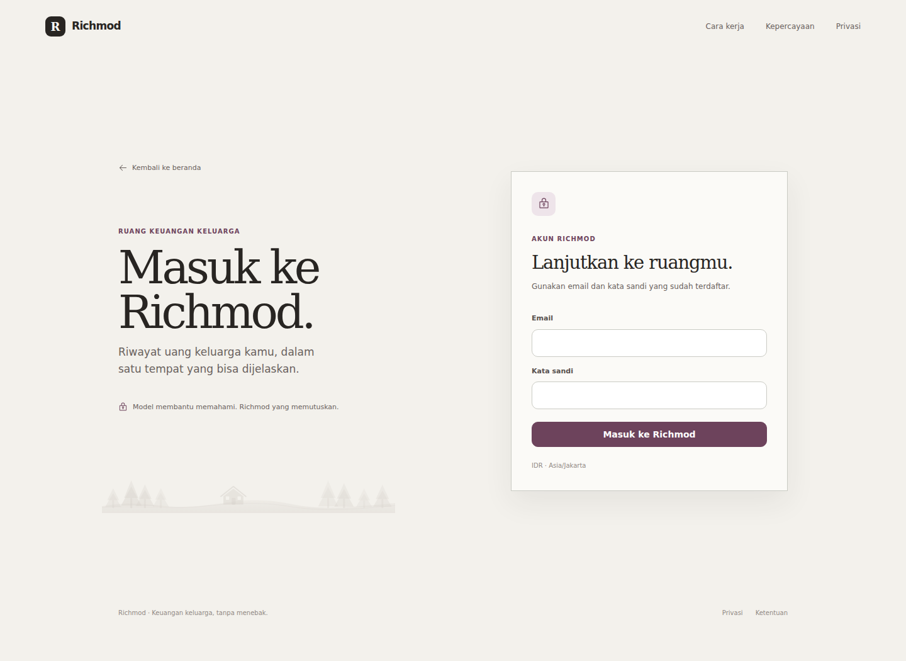
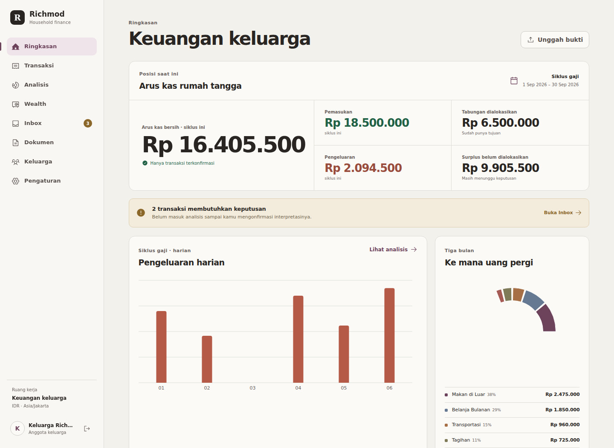
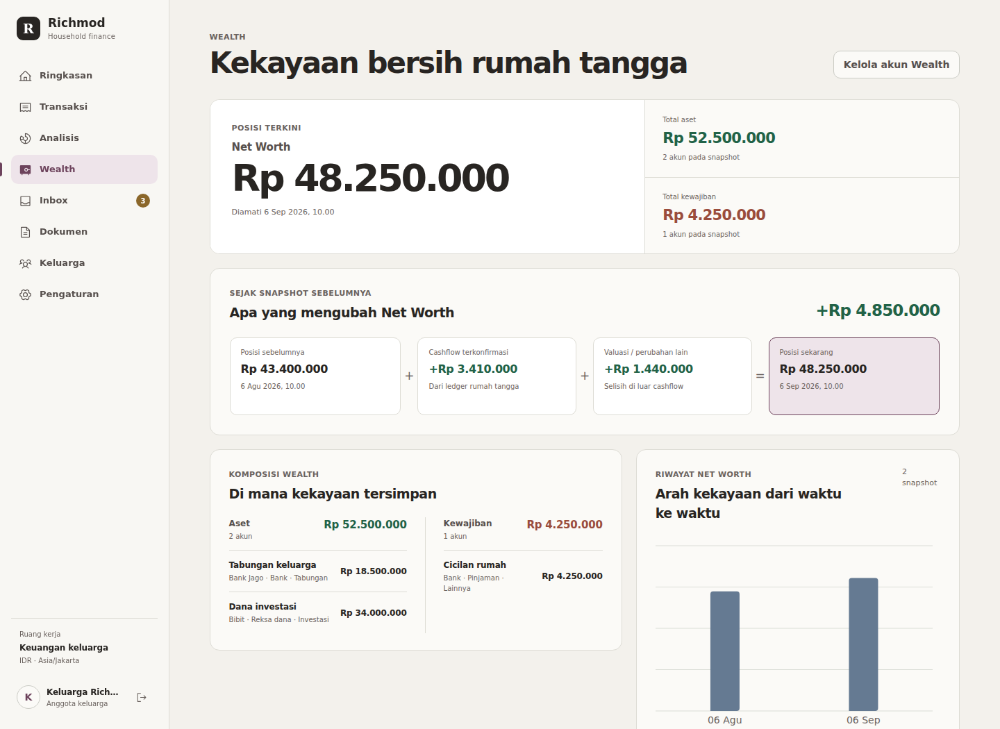
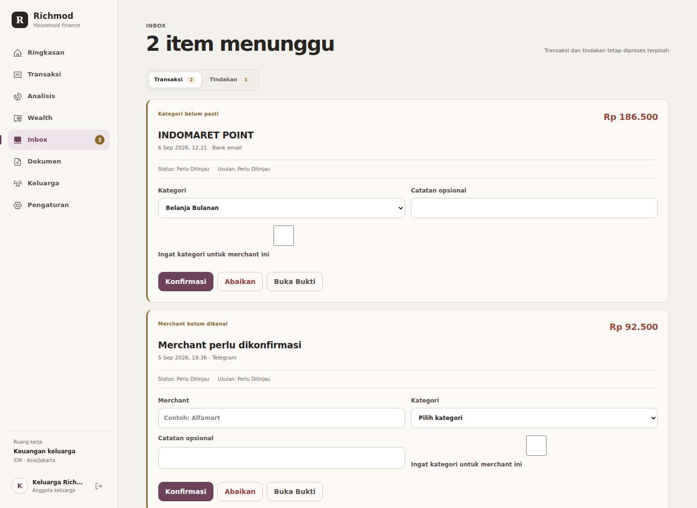
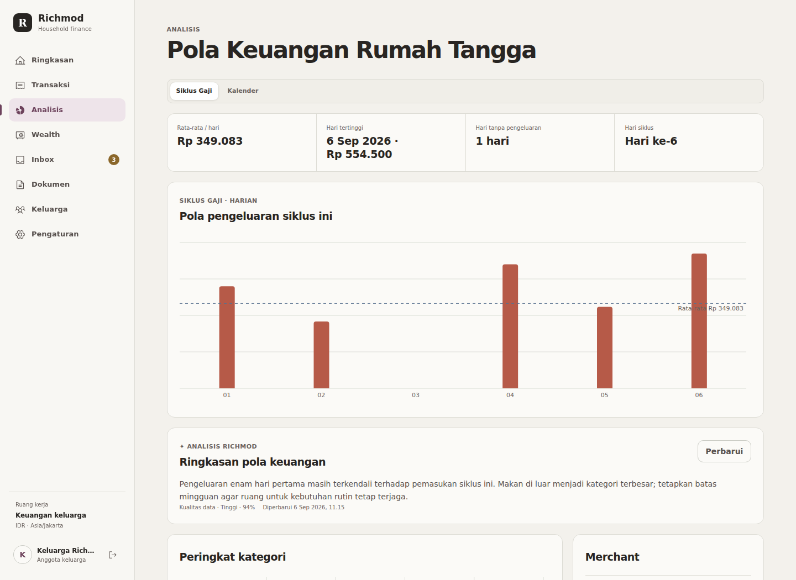
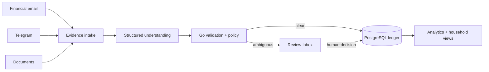
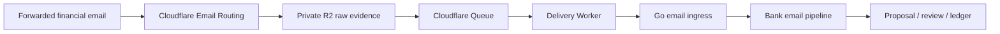

<div align="center">


# Richmod

### Household finance tracking that understands evidence, asks when unsure, and never lets AI guess your ledger.

[](https://github.com/raufimusaddiq/richmod/actions/workflows/ci.yml)


**Email · Telegram · Documents → one household ledger**

</div>

Richmod is a self-hosted household finance system for tracking **income and expenses** without turning personal finance into a second job.

Forward financial notifications, send a message or image through Telegram, or upload receipts, payslips, screenshots, invoices, and transfer proofs. Richmod turns clear evidence into canonical financial records and routes uncertainty to a human instead of silently guessing.

> **LLM understands unstructured input. Go decides whether and how it may change financial state.**

---

## A quick look

| Public landing | Login |
| --- | --- |
|  |  |

| Dashboard | Wealth | Review Inbox |
| --- | --- | --- |
|  |  |  |



Screenshots use synthetic household data. No production financial data is included.
For reproducible capture, verification, and disposable cleanup, see the
[README visual showcase runbook](docs/runbooks/readme-showcase.md).

## Why Richmod

| Evidence first | Household aware | Human when uncertain |
| --- | --- | --- |
| Raw source evidence stays attached to the decisions it supports. | Every mutation is scoped to exactly one household and remains auditable. | Ambiguous facts become review items instead of invented ledger entries. |

Richmod is deliberately conservative around money. PostgreSQL is the source of truth, Go owns financial state transitions, and deterministic paths continue to work even when the LLM gateway is unavailable.

## What it does

| | |
| --- | --- |
| 📩 **Financial Email** | Forward financial notifications without giving Richmod direct bank credentials. Each household gets an opaque, household-scoped ingress address. |
| 💬 **Telegram Assistant** | Ask finance questions, record transactions, send evidence, make corrections, and resolve reviews conversationally. |
| 📄 **Document Understanding** | Process receipts, payslips, invoices, screenshots, transfer proofs, and transaction histories through one evidence pipeline. |
| 🧠 **Human-in-the-loop** | Ambiguous facts never silently become ledger entries. Richmod routes uncertainty to the Review Inbox for an explicit decision. |
| 📊 **Deterministic Analytics** | Explore cashflow, spending, categories, merchants, members, and salary-cycle views from confirmed financial state. |
| 🧾 **Wealth snapshots** | Track household assets and liabilities as dated observations, connect salary-cycle savings to their destination, and review Net Worth over time. |
| 🔎 **Evidence + Audit History** | Preserve source evidence and the decisions it supports so financial state stays explainable and auditable. |

## Wealth and salary-cycle context

Wealth extends the cashflow ledger without replacing it:

- **Cashflow** remains the confirmed income, expense, refund, and transfer history.
- **Savings allocation** records intentional destinations for confirmed transfers.
- **Wealth snapshots** capture observed account values for assets and liabilities at a specific time.
- **Net Worth** brings the latest snapshot together with assets, liabilities, change since the previous observation, and historical context.

Wealth is deliberately observation-based. It does not invent balances, create
transactions from snapshots, or imply live market prices, investment returns, or
portfolio performance.

## How it works



The model can interpret unstructured evidence, but it cannot directly mutate the database. Amounts, identity, household boundaries, transaction state, reconciliation, and final persistence remain deterministic application decisions.

## Three ways data gets in

### 1. Financial email

Each household gets an opaque recipient shaped like:

```text
h_<32hex>@richmod.link
```

The signed recipient selects the household. Sender, subject, body, institution name, and LLM output never do.



Cloudflare delivers the original RFC822 message to `POST /finance/v1/email/inbond` with HMAC and SHA-256 verification. Setup/control emails are dispatched to Integration Actions and never enter the financial LLM flow.

For the deployed Cloudflare resource map, Worker bindings, Queue/DLQ settings, HMAC request contract, forwarding setup, smoke test, and troubleshooting, see the [Cloudflare email ingress runbook](docs/runbooks/cloudflare-email-ingress.md).

### 2. Telegram

Household members connect Telegram through expiring, single-use invitations. Richmod supports text, images, documents, finance queries, corrections, and interactive review.

Review replies and callbacks remain deterministically bound to the exact underlying review object; the model is never asked to guess which transaction a reply refers to when explicit context exists.

### 3. Documents

Receipts, payslips, bank or e-wallet screenshots, invoices, transfer proofs, and transaction histories share one evidence pipeline.

Extraction may use the cloud LLM gateway, but Go validates the result and decides whether the evidence:

- creates a proposal;
- enriches an existing transaction;
- reconciles with another source; or
- needs human review.

## Safety by design

Richmod treats AI output as untrusted input.

- **PostgreSQL is canonical.**
- **Go owns all financial mutations.**
- **Money uses PostgreSQL `NUMERIC`, never floating point.**
- **Every financial mutation is household-scoped and auditable.**
- **Source evidence is preserved.** Deduplication links evidence rather than deleting it.
- **Ambiguity is surfaced, not guessed.**
- **Webhooks and jobs are idempotent.**
- **Deterministic features work without the LLM gateway.**
- **Merchant learning requires explicit opt-in.** One corrected transaction does not silently create a permanent rule.

## Product surfaces

The web app is organized around:

```text
Overview
Transactions
Analytics
Review Inbox
Documents
Household
Settings
Integration Actions
```

Financial review and integration setup are intentionally separate. A forwarding confirmation should never look like a transaction problem, and a transaction ambiguity should never be hidden inside system setup.

## Architecture

| Layer | Technology |
| --- | --- |
| API / financial state transitions | Go |
| Background jobs | Go + PostgreSQL-backed queue |
| Web app | Next.js + React |
| Canonical database | PostgreSQL |
| LLM access | Cloud LLM Gateway |
| Financial email transport | Cloudflare Email Routing + R2 + Queues + Workers |
| Object storage | S3-compatible storage |
| Production edge | Caddy |
| Deployment | Docker Compose + GHCR images |

No LLM receives direct database access, and financial state does not depend on an LLM process being available.

## Quick start

### 1. Configure

```bash
cp .env.example .env
```

Replace every placeholder in `.env` before starting the stack.

### 2. Start Richmod

```bash
docker compose up --build
```

Health endpoints:

```text
http://localhost:8080/healthz
http://localhost:8080/readyz
```

### 3. Create the first owner

Bootstrap can run exactly once. Pass the password through standard input so it does not land in shell history:

```bash
printf '%s\n' 'use-a-unique-12-plus-character-password' \
  | docker compose exec -T api /bootstrap \
      --email owner@example.com \
      --name 'Owner Name' \
      --household 'My Household'
```

This creates the first `OWNER`, household, and Indonesian category seeds in one transaction.

## Current status

The generic Cloudflare email-ingress path is active in production and has completed a real forwarded financial-email flow through bank-email processing and ledger confirmation.

The former Gmail OAuth / Pub/Sub runtime has been fully sunset from the application. Gmail may still be used by a user as a forwarding source, but Richmod no longer depends on Gmail API access.

Current follow-up hardening items include real second-sender acceptance and another off-host backup restore exercise.

## Shipping changes

Pull requests and pushes to `main` run the repository CI path, including secret scanning, Go tests and vet, database-backed integration tests, frontend tests, the Next.js production build, Compose validation, and production image builds.

Successful `main` builds publish immutable images to GHCR. Production deployment is manual and approval-gated: the server pulls released images, runs migrations, and restarts services without building locally.

See [`docs/runbooks/production-deployment.md`](docs/runbooks/production-deployment.md) for the deployment flow.

## Documentation

- [Cloudflare email ingress runbook](docs/runbooks/cloudflare-email-ingress.md)
- [ADR-033: Cloudflare email ingress and Gmail sunset](docs/adr/ADR-033-cloudflare-email-ingress-two-deploy-migration.md)
- [Database schema and ERD](docs/DATABASE_SCHEMA.md)
- [Product Alignment v2](docs/RICHMOD_PRODUCT_ALIGNMENT_V2.md)
- [MVP completion checklist](docs/MVP_COMPLETION_CHECKLIST.md)
- [Wealth, savings, and cycle reconciliation release checklist](docs/WEALTH_SAVINGS_CYCLE_RECONCILIATION_RELEASE_CHECKLIST.md)
- [Production deployment runbook](docs/runbooks/production-deployment.md)
- [`AGENTS.md`](AGENTS.md) for repository architecture and contribution rules

## Scope

Richmod V1 covers **household income and expense tracking**, additive wealth
observations, savings intent classification, and salary-cycle residual
reconciliation. Transactions remain the cashflow ledger; wealth snapshots are
point-in-time observations; residuals become review metadata, not synthetic
transactions.

Supported Wealth V1 is manual, snapshot-level tracking for bank, cash,
e-wallet, mutual fund, gold, brokerage, deposit, crypto, and loan/liability
balances. Explicit non-goals: live NAV or market-price feeds, broker or wallet
sync, per-security positions, cost basis, realized/unrealized P&L, TWR, XIRR,
investment advice, historical savings inference, and automatic
residual-to-transaction conversion.

Bank Email remains the frozen `SPENDING_ONLY` compatibility pipeline. Financial
Provider Email is a generic native-LLM observation path: provider email may
stand alone as evidence, while Go owns household entity resolution,
reconciliation, and canonical mutations. Wealth values are observations and
snapshots, never transactions. Provider-specific production branches are out
of scope.

---

<div align="center">

**Richmod keeps AI useful around money by making uncertainty visible and financial state deterministic.**

</div>
