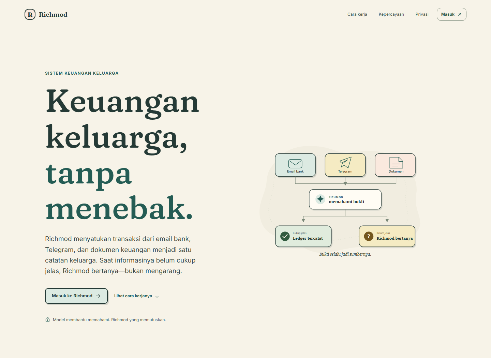
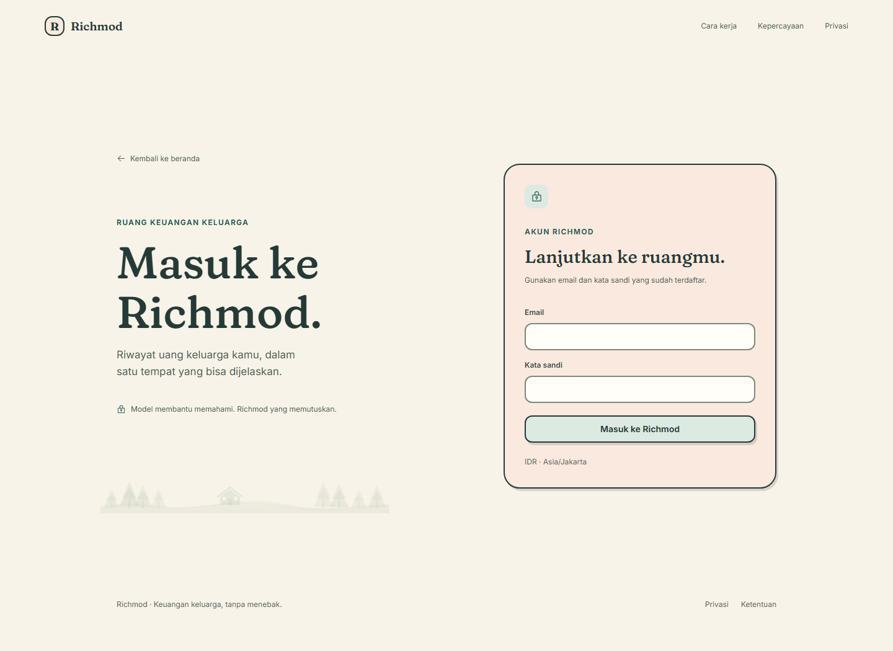
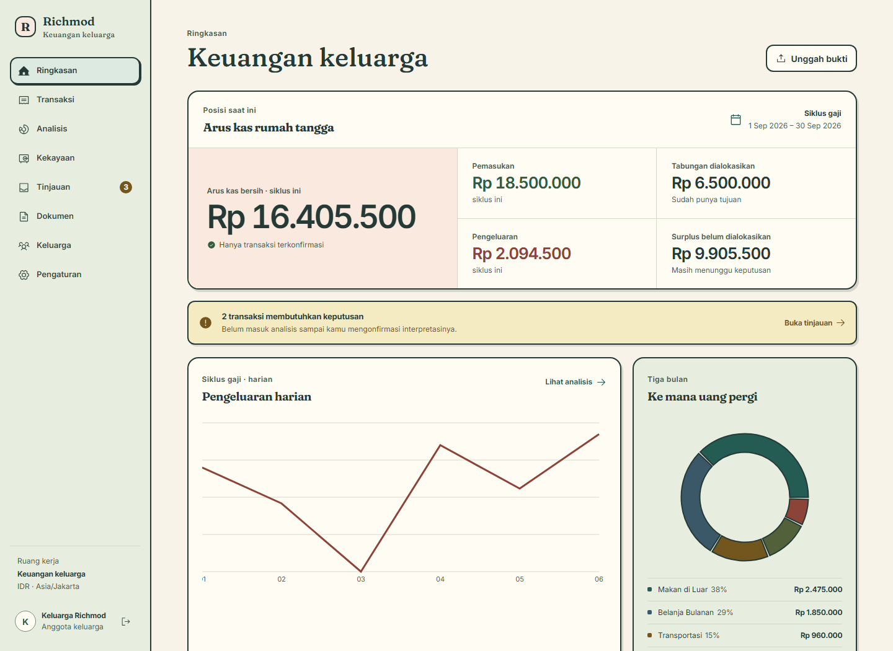
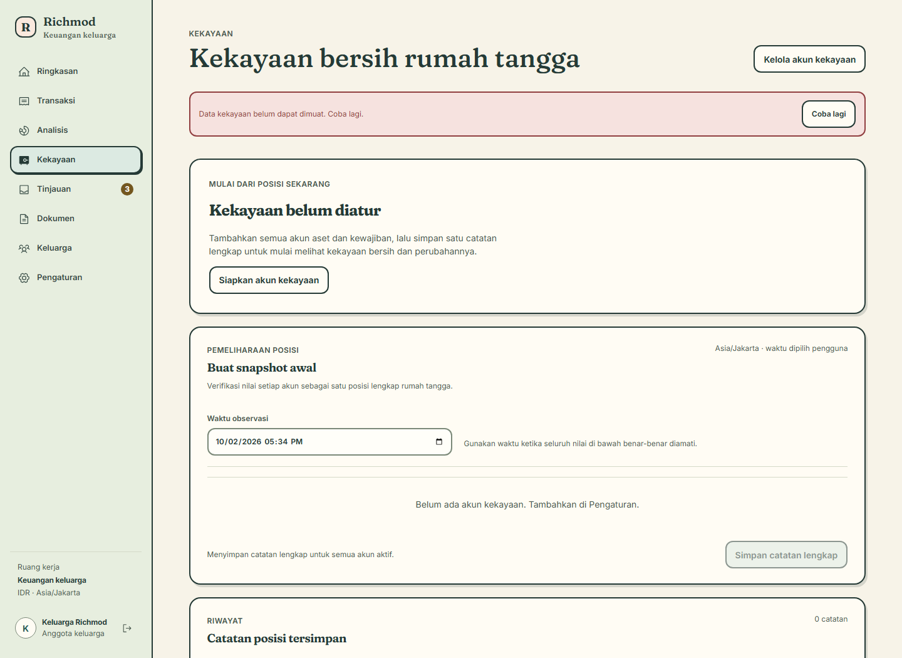
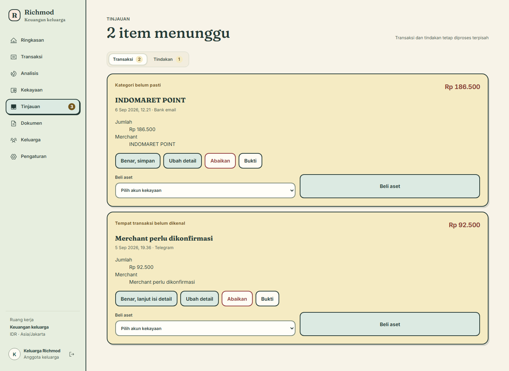
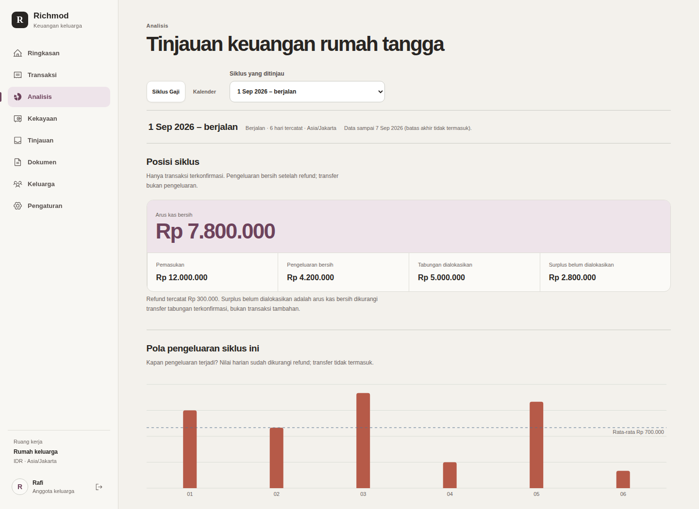
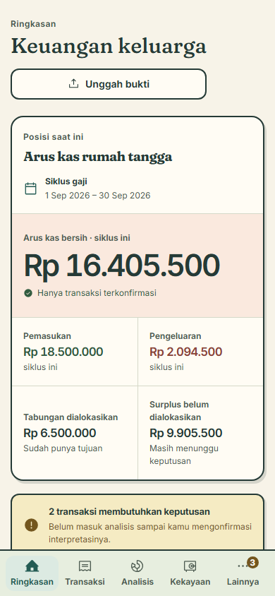
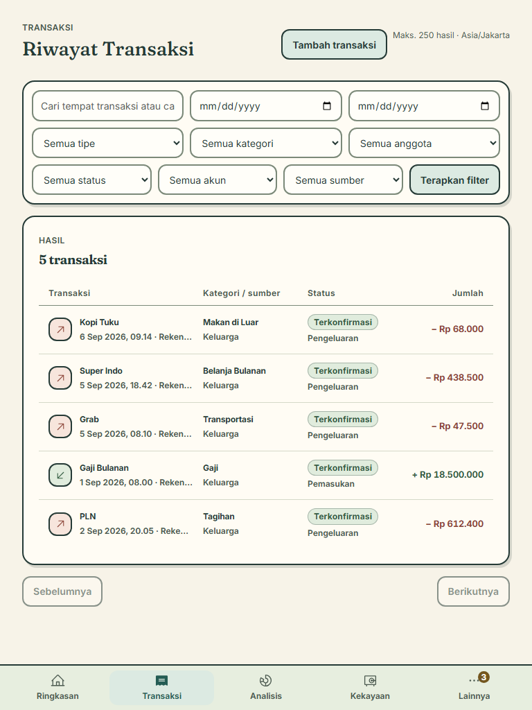
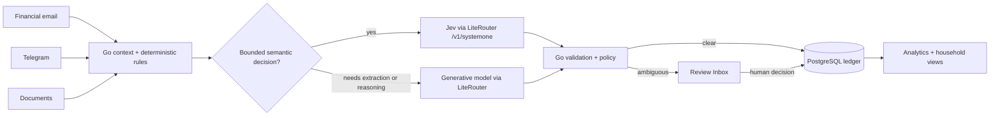
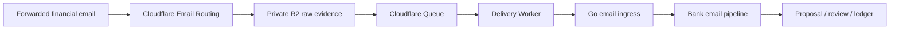

<div align="center">


# Richmod

### Household finance tracking that understands evidence, asks when unsure, and never lets AI guess your ledger.

[](https://github.com/raufimusaddiq/richmod/actions/workflows/ci.yml)


**Email · Telegram · Documents → one household ledger**

</div>

Richmod is a self-hosted household finance system for tracking **income and
expenses** without turning personal finance into a second job.

Forward financial notifications, send a message or image through Telegram, or
upload receipts, payslips, screenshots, invoices and transfer proofs. Richmod
turns clear evidence into canonical financial records and routes uncertainty to
a human instead of silently guessing.

> **Deterministic Go handles facts, Jev handles bounded semantic judgment,
> generative models handle open-ended understanding, and Go still owns
> financial state.**

## Contents

- [A quick look](#a-quick-look)
- [Features](#features)
- [How it works](#how-it-works)
- [Safety by design](#safety-by-design)
- [Tech stack](#tech-stack)
- [Getting started](#getting-started)
- [Development](#development)
- [Status](#status)
- [Scope](#scope)
- [Documentation](#documentation)

---

## A quick look

| Public landing | Login |
| --- | --- |
|  |  |

| Dashboard | Wealth | Review Inbox |
| --- | --- | --- |
|  |  |  |



| Phone | Tablet |
| --- | --- |
|  |  |

The layout adapts from desktop to tablet to phone: a bottom tab bar replaces the
sidebar, cards stack, and the transaction list switches between a full table and
compact rows.

<details>
<summary>About these screenshots</summary>

- They use synthetic household data; no production financial data is included.
- Desktop images are 1440x1050; phone and tablet images are 390x844 and 768x1024.
- The cycle comparison chart in the Analytics image appears once a household has
  four closed salary cycles. With fewer, Richmod shows one summary card per
  cycle, so a new household sees the card layout first.
- `npm run capture:readme` regenerates them; see the
  [README showcase runbook](docs/runbooks/readme-showcase.md).

</details>

## Features

| | |
| --- | --- |
| 📩 **Financial email** | Forward financial notifications without giving Richmod bank credentials. Each household gets an opaque, household-scoped ingress address. |
| 💬 **Telegram assistant** | Ask finance questions, record transactions, send evidence, make corrections and resolve reviews conversationally. |
| 📄 **Document understanding** | Receipts, payslips, invoices, screenshots, transfer proofs and transaction histories go through one evidence pipeline. |
| 🧠 **Human in the loop** | Ambiguous facts never silently become ledger entries; they go to the Review Inbox for an explicit decision. |
| 📊 **Deterministic analytics** | Salary-cycle outcomes, previous and recent-median comparisons, merchant and transaction drivers, savings, Wealth and loose ends. AI discussion is optional; the full review works without it. |
| 🧾 **Wealth snapshots** | Dated observations of assets and liabilities, salary-cycle savings linked to their destination, and Net Worth over time. |
| 🔎 **Evidence and audit history** | Source evidence stays attached to the decisions it supports, so financial state remains explainable. |

### Wealth alongside the cashflow ledger

Wealth extends the ledger without replacing it:

- **Cashflow** is the confirmed income, expense, refund and transfer history.
- **Savings allocation** records intentional destinations for confirmed transfers.
- **Wealth snapshots** capture observed account values at a specific time.
- **Net Worth** combines the latest snapshot's assets and liabilities with the
  change since the previous observation.

Wealth is observation-based. It never invents balances, creates transactions
from snapshots, or implies live prices, returns or portfolio performance.

### The web app

| Page | Indonesian label | Notes |
| --- | --- | --- |
| Overview | Ringkasan | |
| Transactions | Transaksi | |
| Analytics | Analisis | Follows the [cycle-review UI contract](docs/ANALYTICS_CYCLE_REVIEW_UI.md) |
| Wealth | Kekayaan | |
| Review Inbox | Tinjauan | **Transactions** tab and **Actions** tab |
| Documents | Dokumen | |
| Household | Keluarga | |
| Settings | Pengaturan | |
| Admin | Admin | Platform operator console, super admins only |

The interface is in Indonesian; this documentation uses the English names.

Financial review and integration setup are kept apart: a forwarding confirmation
never looks like a transaction problem, and a transaction ambiguity is never
hidden inside system setup. The Actions tab also lists source events that failed
for good, such as an unusable bank email or a job that gave up, as dismissable
items rather than false reviews
([ADR-049](docs/adr/ADR-049-failed-sources-surface-as-actions.md)).

## How it works


```mermaid
flowchart LR
    E[Financial email] --> G[Go context + deterministic rules]
    T[Telegram] --> G
    D[Documents] --> G

    G --> J{Bounded semantic decision?}
    J -->|yes| S[Jev via LiteRouter /v1/systemone]
    J -->|needs extraction or reasoning| M[Generative model via LiteRouter]

    S --> P[Go validation + policy]
    M --> P

    P -->|clear| L[(PostgreSQL ledger)]
    P -->|ambiguous| R[Review Inbox]

    R -->|human decision| L
    L --> A[Analytics + household views]
```

Exact facts, arithmetic, authorization, target binding, reconciliation and
persistence are deterministic Go decisions. Jev handles bounded semantic choices
when the output domain is known; generative models are reserved for arbitrary
extraction, vision, open-ended reasoning and prose. Neither can mutate the
database.

### Financial email

Each household gets an opaque recipient such as `h_<32hex>@richmod.link`. The
signed recipient selects the household; sender, subject, body, institution name
and model output never do.


```mermaid
flowchart LR
    M[Forwarded financial email] --> C[Cloudflare Email Routing]
    C --> R2[Private R2 raw evidence]
    R2 --> Q[Cloudflare Queue]
    Q --> W[Delivery Worker]
    W --> G[Go email ingress]
    G --> B[Bank email pipeline]
    B --> P[Proposal / review / ledger]
```

Cloudflare delivers the original RFC822 message to
`POST /finance/v1/email/inbond` with HMAC and SHA-256 verification. Setup and
control emails go to Integration Actions and never enter the financial model
flow. Resources, bindings, the request contract, forwarding setup and
troubleshooting are in the
[Cloudflare email ingress runbook](docs/runbooks/cloudflare-email-ingress.md).

### Telegram

Household members connect through expiring, single-use invitations. Richmod
accepts text, images, documents, finance questions, corrections and review
replies. Replies and button taps are bound to the exact review they answer; the
model is never asked to guess which transaction a reply means when explicit
context exists.

### Documents

Every finance image or document uses one evidence pipeline. Extraction may use a
generative model and bounded judgments may use Jev, both through LiteRouter. Go
validates the result and decides whether the evidence:

- creates a proposal;
- enriches an existing transaction;
- reconciles with another source; or
- needs human review.

## Safety by design

Richmod treats AI output as untrusted input.

- **PostgreSQL is canonical**, and **Go owns every financial mutation**.
- **Money uses PostgreSQL `NUMERIC`**, never floating point.
- **Every financial mutation is household-scoped and auditable.**
- **Source evidence is preserved.** Deduplication links evidence rather than deleting it.
- **Ambiguity is surfaced, not guessed.**
- **Webhooks and jobs are idempotent.**
- **Deterministic features keep working without the AI gateway.**
- **Merchant learning is opt-in.** One corrected transaction does not silently create a permanent rule.
- **No model gets database access**, and Richmod authenticates only to
  LiteRouter; upstream provider credentials stay in the gateway.

## Tech stack

| Layer | Technology |
| --- | --- |
| API and financial state transitions | Go |
| Background jobs | Go + PostgreSQL-backed queue |
| Web app | Next.js + React |
| Canonical database | PostgreSQL |
| AI model access | LiteRouter / Cloud AI Gateway: generative Responses and native System One |
| Financial email transport | Cloudflare Email Routing + R2 + Queues + Workers |
| Object storage | S3-compatible storage |
| Production edge | Caddy |
| Deployment | Docker Compose + GHCR images |

## Getting started

**1. Configure.** Copy the example environment and replace every placeholder:

```bash
cp .env.example .env
```

[`.env.example`](.env.example) is grouped by concern (database, LLM gateway,
Telegram, email ingress, storage, judgment plane, backups). Optional variables
are blank and say what an empty value means.

**2. Start the stack.**

```bash
docker compose up --build
```

Health checks: `http://localhost:8080/healthz` and `http://localhost:8080/readyz`.

**3. Create the first owner.** Bootstrap runs exactly once and creates the first
`OWNER`, the household and the Indonesian category seeds in one transaction.
Pass the password on standard input so it stays out of shell history:

```bash
printf '%s\n' 'use-a-unique-12-plus-character-password' \
  | docker compose exec -T api /bootstrap \
      --email owner@example.com \
      --name 'Owner Name' \
      --household 'My Household'
```

### Configuration files

| File | What it is |
| --- | --- |
| [`.env.example`](.env.example) | The full environment, grouped by concern. Copy to `.env`; never commit the copy. |
| [`infra/cloudflare-email-ingress/wrangler.toml.example`](infra/cloudflare-email-ingress/wrangler.toml.example) | The ingress Worker: stores the raw message in R2 and enqueues metadata. Holds no secret. |
| [`infra/cloudflare-email-delivery/wrangler.toml.example`](infra/cloudflare-email-delivery/wrangler.toml.example) | The delivery Worker: consumes the queue and posts to the API. Its signing secret is set with `wrangler secret put`, never in the file. |

The Cloudflare examples use a placeholder API hostname; replace it with your own.

## Development

```bash
# Web: unit and lock tests, then the production build
cd apps/web && npm ci && npm test && npm run build

# API and worker
cd apps/api && go test ./... && go vet ./...
cd apps/worker && go test ./... && go vet ./...
```

- Database-backed tests need an isolated PostgreSQL; the
  [disposable test matrix](docs/runbooks/disposable-test-matrix.md) has the
  exact commands and the cleanup.
- `npm run test:visual` renders every route at six viewport sizes against
  synthetic API fixtures.

### Shipping changes

`main` is protected. A change reaches it through a pull request whose required
checks pass, including CI and the automated Hermes Review, and is merged with a
merge commit. CI covers secret scanning, Go tests and vet, database-backed
integration tests, frontend tests, the Next.js production build, Compose
validation and image builds.

Successful `main` builds publish immutable images to GHCR. Production deployment
is manual and approval-gated: the server pulls released images, runs migrations
and restarts services without building locally. See the
[sprint delivery runbook](docs/runbooks/sprint-delivery.md) and the
[production deployment runbook](docs/runbooks/production-deployment.md), and
[`CONTRIBUTING.md`](CONTRIBUTING.md) before proposing a change.

## Status

The latest release is
[v0.beta](https://github.com/raufimusaddiq/richmod/releases/tag/v0.beta).

- The generic Cloudflare email-ingress path runs in production and has completed
  a real forwarded financial-email flow through to ledger confirmation.
- The former Gmail OAuth / Pub/Sub runtime is fully sunset. Gmail can still be a
  forwarding source, but Richmod no longer uses the Gmail API.
- The web interface is responsive across phones, tablets and desktops. Controls
  are labelled, interface text is 12px or larger (chart axis ticks and a few
  admin helper lines are the known exceptions), and scrolling regions are
  reachable by keyboard. The
  [2026-10-02 UI audit](docs/audits/UI-AUDIT-2026-10-02.md) records what remains
  open.
- Open hardening items: real second-sender acceptance and another off-host
  backup restore exercise.

## Scope

Richmod V1 covers **household income and expense tracking**, additive Wealth
observations, savings intent classification and salary-cycle residual
reconciliation. Transactions remain the cashflow ledger; Wealth snapshots are
point-in-time observations; residuals are review metadata, not synthetic
transactions.

Wealth V1 is manual, snapshot-level tracking for bank, cash, e-wallet, mutual
fund, gold, brokerage, deposit, crypto and loan/liability balances.

Bank Email is the frozen `SPENDING_ONLY` compatibility pipeline. Financial
Provider Email is a generic observation path: provider email can stand alone as
evidence, while Go owns household entity resolution, reconciliation and
canonical mutations.

**Not in scope:** live NAV or market-price feeds, broker or wallet sync,
per-security positions, cost basis, realized/unrealized P&L, TWR, XIRR,
investment advice, historical savings inference, automatic
residual-to-transaction conversion, and provider-specific production branches.

## Documentation

Start with the [documentation index](docs/README.md), which lists the current
documents; historical PRDs and checklists are in [`docs/archive/`](docs/archive/README.md).

| Topic | Documents |
| --- | --- |
| Rules and contributing | [`AGENTS.md`](AGENTS.md), [`CONTRIBUTING.md`](CONTRIBUTING.md), [`SECURITY.md`](SECURITY.md) |
| Architecture | [ADR index](docs/adr/README.md), [ADR-038: System One semantic decision plane](docs/adr/ADR-038-system-one-semantic-decision-plane.md), [Jev / System One PRD](docs/RICHMOD_JEV_SYSTEM_ONE_PRD.md) |
| Email and Telegram | [ADR-033: Cloudflare email ingress](docs/adr/ADR-033-cloudflare-email-ingress-two-deploy-migration.md) and [ADR-033: Bounded conversational agent](docs/adr/ADR-033-bounded-natural-conversational-agent.md) (two current records share the number) |
| Data | [Database schema and ERD](docs/DATABASE_SCHEMA.md) |
| Product | [Product Alignment v2](docs/RICHMOD_PRODUCT_ALIGNMENT_V2.md), [MVP completion checklist](docs/MVP_COMPLETION_CHECKLIST.md), [Analytics contract](docs/ANALYTICS_CYCLE_REVIEW_UI.md) |
| Operations | [Production deployment](docs/runbooks/production-deployment.md), [sprint delivery](docs/runbooks/sprint-delivery.md), [disposable test matrix](docs/runbooks/disposable-test-matrix.md), [Cloudflare email ingress](docs/runbooks/cloudflare-email-ingress.md) |
| Interface | [Brand guidelines](docs/brand-guidelines.md), [UI audit](docs/audits/UI-AUDIT-2026-10-02.md) |

---

<div align="center">

**Richmod keeps AI useful around money by making uncertainty visible and financial state deterministic.**

</div>
