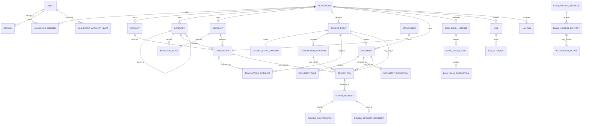

# Richmod database schema and ERD

## Purpose and source of truth

This is the human-readable map of Richmod's PostgreSQL schema. It reflects the
forward migration set through `db/migrations/00054_transfer_wealth_compatibility.sql`.
The executable migration files remain the canonical definition; use this document
to understand relationships, ownership, and product boundaries before changing
them.

Richmod keeps canonical financial state in PostgreSQL. Go performs state
transitions. LLM calls are recorded for operations/audit only and never grant
the model database mutation authority.

## Maintenance rule

Every migration that creates, drops, renames, or materially changes a table,
column, constraint, index, enum/check domain, or foreign-key relationship **must
update this file in the same branch**. Update the schema version above, affected
table entry, and ERD when the relationship changes. The migration review must
confirm both the executable SQL and this document describe the same resulting
schema.

For a live database, verify the applied state separately:

```bash
goose -dir db/migrations postgres "$DATABASE_URL" status
```

## Conventions and invariants

- UUID primary keys use `gen_random_uuid()` unless noted; operational logs may
  use `BIGSERIAL`.
- Financial amounts are `NUMERIC`, never floating point. The canonical ledger is
  IDR-only and transaction amount is positive; `transaction.type` carries the
  direction/meaning.
- `transfer_wealth_compatible` is the shared mutation-boundary rule for transfer
  purpose, Wealth side, usage role, active state, and household ownership.
- Canonical financial and evidence records are household-scoped. Source evidence
  is linked, deduplicated, and retained rather than hard-deleted.
- `TIMESTAMPTZ` records time. Household timezone is constrained to
  `Asia/Jakarta`.
- Status/type columns use SQL `CHECK` constraints. Read the named migration for
  the exact allowed values; do not infer state transitions from the ERD.
- Some references are intentionally polymorphic (`audit_log`,
  `telegram_turn_reference`, `platform_audit_log`); their target is recorded by
  type plus ID, not a database foreign key.

## Entity relationship diagram

The diagram shows ownership and principal product relationships, not every
operational index or polymorphic reference.



## Table reference

### Identity, access, and tenancy

| Table | Purpose | Principal relationships / constraints |
| --- | --- | --- |
| `household` | Financial tenant and Jakarta-timezone boundary. | Parent of household-scoped product data. |
| `user` | Dashboard identity and password state. | Unique normalized email; optional super-admin flag. |
| `household_member` | Membership and role. | Composite PK `(household_id, user_id)`; active membership is limited to one household per user. |
| `session` | Revocable dashboard session. | `user_id → user`; unique token hash. |
| `dashboard_account_invite` | Dashboard account invitation. | References household, invited user, and creating user; invite token is stored as a hash. |
| `telegram_identity` | Authorized Telegram identity for a household member. | Numeric Telegram user ID; links `household` and `user`. |
| `telegram_link_invite` | One-time Telegram household-link invitation. | `household_id`, `created_by_user_id`; hashed token. |

### Canonical ledger and configuration

| Table | Purpose | Principal relationships / constraints |
| --- | --- | --- |
| `account` | Household bank, cash, e-wallet, or other account. | `household_id → household`; tracking policy; system-managed account metadata. |
| `known_account` | Recognized counterparty/account hint. | Household-scoped; optional owning `user`. |
| `category` | Hierarchical household category. | Self-referencing `parent_id`; unique slugs within a root/parent scope. |
| `merchant` | Canonical household merchant identity. | Canonically normalized name, unique case-insensitively per household. |
| `merchant_alias` | Raw merchant name mapped to canonical merchant/category. | `normalized_merchant_id → merchant`; optional default category. |
| `transaction` | Canonical financial record. | Household-scoped; optional account, merchant, category, and creator; never a direct LLM write target. |
| `transaction_evidence` | Many-to-many evidence link for a transaction. | `transaction_id → transaction`, `source_event_id → source_event`; preserves source linkage. |
| `reconciliation_merge` | Audited merge from duplicate source transaction to target transaction. | Household-scoped; source/target both reference `transaction`. |
| `reconciliation_merge_evidence` | Evidence copied during a reconciliation merge. | `merge_id → reconciliation_merge`; original/copied transaction evidence references. |
| `budget` | Household category budget for a period. | `household_id`, `category_id`, `created_by_user_id`; active period/category uniqueness. |
| `salary_source` | Configured salary source and cycle anchor. | Household-scoped; optional associated user and one active primary source per household. |
| `salary_event` | Observed or confirmed salary event. | `salary_source_id → salary_source`; links source evidence/transaction where available. |
| `salary_pending_choice` | Pending human choice for salary attribution. | Household-scoped; references canonical `transaction`. |

### Evidence, intake, and extraction

| Table | Purpose | Principal relationships / constraints |
| --- | --- | --- |
| `source_event` | Immutable intake envelope for bank email, Telegram, web, or system evidence. | Household-scoped; external-ID/payload-hash deduplication; Telegram message/album metadata. |
| `source_event_payload` | Inline source payload storage. | One-to-one with `source_event`. |
| `attachment` | Stored uploaded or fetched binary metadata. | Household-scoped; object key/hash/content metadata. |
| `document` | Evidence document derived from a source event and attachment. | One source event per document; links `attachment`. |
| `document_page` | Page/image record for a multi-page document. | `document_id → document`; ordered page content. |
| `document_extraction` | Structured extraction attempt/result. | `document_id → document`; extraction state, facts, and model metadata. |
| `bank_email_listener` | Household-scoped bank-email listener configuration. | References household/account; fixed spending-only policy in application behavior. |
| `bank_email_event` | Bank-email processing record. | References listener and source event; message ID is the provider-neutral identifier. |
| `bank_email_extraction` | Bank-email extraction result. | Shares the bank-email source-event identity; supports deterministic validation/review. |
| `email_ingress_address` | Provisioned Cloudflare email address. | Household-scoped; one current bank-email address per household. |
| `email_ingress_delivery` | Received provider delivery and authentication metadata. | References ingress address; optional listener/source event. |

### Proposals, reviews, and Telegram decisions

| Table | Purpose | Principal relationships / constraints |
| --- | --- | --- |
| `transaction_proposal` | Untrusted interpretation awaiting deterministic handling. | Household/source-event scoped; may become a transaction or review item. |
| `review_item` | Canonical actionable human-review unit. | May reference a transaction, proposal, source event, or document; active uniqueness prevents duplicate open work. |
| `review_request` | Telegram delivery/request for review. | Optional `review_item_id`; retains older transaction/proposal review linkage. |
| `review_request_recipient` | Per-recipient Telegram delivery binding. | `review_request_id → review_request`; stores chat/message IDs. |
| `review_conversation` | Human review messages and resolution context. | `review_request_id → review_request`. |
| `telegram_pending_action` | Deterministically bound Telegram follow-up action. | Household/Telegram scoped; references transaction and optional proposed category. |
| `telegram_pending_batch` | Pending multi-expense Telegram batch. | Household/Telegram scoped; binds batch selection safely. |
| `telegram_conversation_turn` | Bounded finance conversation turn. | Household/Telegram scoped; optional source event; tool turns hold public context only. |
| `telegram_turn_reference` | Short-lived transaction/review reference usable in a Telegram turn. | `turn_id → telegram_conversation_turn`; typed target ID is intentionally polymorphic. |

### Jobs, insights, LLM observability, and administration

| Table | Purpose | Principal relationships / constraints |
| --- | --- | --- |
| `job` | PostgreSQL-backed durable work queue. | Household/source event payload; lane is enforced by database trigger. |
| `job_retry_log` | Retry attempt operational history. | `job_id` logical reference; unique attempt per job. |
| `worker_heartbeat` | Worker liveness/operational status. | Worker instance identity and observed timestamp. |
| `llm_call` | LLM-call telemetry. | Optional household; task/protocol/model/status/cost metadata only. |
| `insight` | Generated household analytics narrative. | Household/time-period scoped; non-authoritative product output. |
| `audit_log` | Household financial/audit trail. | Household/user optional; typed entity ID is polymorphic. |
| `platform_audit_log` | Platform-admin audit trail. | `actor_user_id → user`; typed entity ID is polymorphic. |
| `integration_action` | Setup/integration action surfaced in Inbox. | Household-scoped; optional email-ingress delivery and resolving user. |

## Change checklist

When adding or changing a migration:

1. Add a new forward-only migration in `db/migrations/`; do not edit applied SQL.
2. Update this document's schema version, table reference, ERD, and invariants
   where applicable.
3. Apply the migration to disposable PostgreSQL and run affected API/worker
   tests as required by `docs/runbooks/disposable-test-matrix.md`.
4. Review tenant scoping, evidence retention, auditability, idempotency, and
   rollback/down-migration behavior explicitly.
5. Include the schema-document update in the same commit as the migration.
