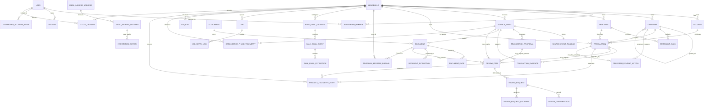

# Richmod database schema and ERD

## Purpose and source of truth

This is the human-readable map of Richmod's PostgreSQL schema. It reflects the
forward migration set through `db/migrations/00081_job_lanes_and_review_request_link.sql`.
The executable migration files remain the canonical definition; use this document
to understand relationships, ownership, and product boundaries before changing
them.

Richmod keeps canonical financial state in PostgreSQL. Go performs state
transitions. LLM calls are recorded for operations/audit only and never grant
the model database mutation authority.

## Maintenance rule

Every migration that creates, drops, renames, or materially changes a table,
column, constraint, index, enum/check domain, or foreign-key relationship **must
update this file in the same branch**. Update the schema version above, affected
table entry, and ERD when the relationship changes. The migration review must
confirm both the executable SQL and this document describe the same resulting
schema.

For a live database, verify the applied state separately:

```bash
goose -dir db/migrations postgres "$DATABASE_URL" status
```

## Conventions and invariants

- UUID primary keys use `gen_random_uuid()` unless noted; operational logs may
  use `BIGSERIAL`.
- Financial amounts are `NUMERIC`, never floating point. The canonical ledger is
  IDR-only and transaction amount is positive; `transaction.type` carries the
  direction/meaning.
- `transfer_wealth_compatible` is the shared mutation-boundary rule for transfer
  purpose, Wealth side, usage role, active state, and household ownership.
- Canonical financial and evidence records are household-scoped. Source evidence
  is linked, deduplicated, and retained rather than hard-deleted.
- `TIMESTAMPTZ` records time. Household timezone is constrained to
  `Asia/Jakarta`.
- Status/type columns use SQL `CHECK` constraints. Read the named migration for
  the exact allowed values; do not infer state transitions from the ERD.
- Some references are intentionally polymorphic (`audit_log`,
  `telegram_turn_reference`, `platform_audit_log`); their target is recorded by
  type plus ID, not a database foreign key.
- Conversational LLM phases never write the ledger directly. `telegram_pending_action`
  stores server-owned proposed date/category/description changes until Go applies
  or cancels them. `llm_call.call_kind` distinguishes strict native calls from
  conversational `AGENT_TEXT`/`AGENT_TOOLS` phases and the bounded decision plane
  (`JUDGMENT`/`DECISION`) without storing content.
- Every new `review_item` carries a complete ReviewDecision contract
  (`decision` with a non-empty `reasonCode` and a non-empty `allowedActions`
  array), enforced by the `review_item_require_decision` trigger (migration
  `00078`). Historical rows created before the contract keep `decision IS NULL`;
  they are retained and readable, never backfilled or deleted, and the trigger
  refuses to make them active (`OPEN`/`PENDING_SEND`) again. The migration
  aborts if any active item lacks a complete contract.

## Entity relationship diagram

The diagram shows ownership and principal product relationships, not every
operational index or polymorphic reference.


```mermaid
erDiagram
    USER ||--o{ HOUSEHOLD_MEMBER : belongs_to
    HOUSEHOLD ||--o{ HOUSEHOLD_MEMBER : has
    USER ||--o{ SESSION : owns
    USER ||--o{ DASHBOARD_ACCOUNT_INVITE : invited_by
    HOUSEHOLD ||--o{ ACCOUNT : owns
    HOUSEHOLD ||--o{ CATEGORY : owns
    CATEGORY ||--o{ CATEGORY : parent_of
    HOUSEHOLD ||--o{ MERCHANT : owns
    MERCHANT ||--o{ MERCHANT_ALIAS : resolves
    CATEGORY ||--o{ MERCHANT_ALIAS : defaults
    HOUSEHOLD ||--o{ SOURCE_EVENT : receives
    SOURCE_EVENT ||--|| SOURCE_EVENT_PAYLOAD : stores
    SOURCE_EVENT ||--o{ TRANSACTION_PROPOSAL : proposes
    HOUSEHOLD ||--o{ TRANSACTION : owns
    ACCOUNT ||--o{ TRANSACTION : attributes
    CATEGORY ||--o{ TRANSACTION : classifies
    MERCHANT ||--o{ TRANSACTION : identifies
    TRANSACTION ||--o{ TRANSACTION_EVIDENCE : supported_by
    SOURCE_EVENT ||--o{ TRANSACTION_EVIDENCE : supports
    SOURCE_EVENT ||--o| DOCUMENT : creates
    ATTACHMENT ||--o{ DOCUMENT : stores
    DOCUMENT ||--o{ DOCUMENT_PAGE : contains
    DOCUMENT ||--o{ DOCUMENT_EXTRACTION : extracted_as
    TRANSACTION ||--o{ REVIEW_ITEM : may_require
    TRANSACTION_PROPOSAL ||--o{ REVIEW_ITEM : may_require_amount
    SOURCE_EVENT ||--o{ REVIEW_ITEM : may_require
    DOCUMENT ||--o{ REVIEW_ITEM : may_require
    REVIEW_ITEM ||--o{ REVIEW_REQUEST : delivered_as
    REVIEW_REQUEST ||--o{ REVIEW_CONVERSATION : records
    REVIEW_REQUEST ||--o{ REVIEW_REQUEST_RECIPIENT : sends_to
    HOUSEHOLD ||--o{ TELEGRAM_MESSAGE_BINDING : records
    DOCUMENT ||--o{ TELEGRAM_MESSAGE_BINDING : bound_to
    HOUSEHOLD ||--o{ BANK_EMAIL_LISTENER : configures
    BANK_EMAIL_LISTENER ||--o{ BANK_EMAIL_EVENT : receives
    BANK_EMAIL_EVENT ||--o{ BANK_EMAIL_EXTRACTION : extracts
    EMAIL_INGRESS_ADDRESS ||--o{ EMAIL_INGRESS_DELIVERY : receives
    EMAIL_INGRESS_DELIVERY ||--o{ INTEGRATION_ACTION : may_require
    HOUSEHOLD ||--o{ JOB : queues
    JOB ||--o{ JOB_RETRY_LOG : retries
    HOUSEHOLD ||--o{ LLM_CALL : observes
    HOUSEHOLD ||--o{ INTELLIGENCE_PHASE_TELEMETRY : observes
    SOURCE_EVENT ||--o{ INTELLIGENCE_PHASE_TELEMETRY : correlates
    HOUSEHOLD ||--o{ PRODUCT_TELEMETRY_EVENT : records
    TRANSACTION ||--o{ PRODUCT_TELEMETRY_EVENT : measures
    REVIEW_ITEM ||--o{ PRODUCT_TELEMETRY_EVENT : measures
    HOUSEHOLD ||--o{ CYCLE_DECISION : records
    USER ||--o{ CYCLE_DECISION : authors
    TRANSACTION ||--o{ TELEGRAM_PENDING_ACTION : may_be_edited_by
    CATEGORY ||--o{ TELEGRAM_PENDING_ACTION : proposed_category
```

## Table reference

### Identity, access, and tenancy

| Table | Purpose | Principal relationships / constraints |
| --- | --- | --- |
| `household` | Financial tenant and Jakarta-timezone boundary. | Parent of household-scoped product data. |
| `user` | Dashboard identity and password state. | Unique normalized email; optional super-admin flag. |
| `household_member` | Membership and role. | Composite PK `(household_id, user_id)`; active membership is limited to one household per user. |
| `session` | Revocable dashboard session. | `user_id → user`; unique token hash. |
| `dashboard_account_invite` | Dashboard account invitation. | References household, invited user, and creating user; invite token is stored as a hash. |
| `telegram_identity` | Authorized Telegram identity for a household member. | Numeric Telegram user ID; links `household` and `user`. |
| `telegram_link_invite` | One-time Telegram household-link invitation. | `household_id`, `created_by_user_id`; hashed token. |

### Canonical ledger and configuration

| Table | Purpose | Principal relationships / constraints |
| --- | --- | --- |
| `account` | Household bank, cash, e-wallet, or other account. | `household_id → household`; tracking policy; system-managed account metadata. |
| `known_account` | Recognized counterparty/account hint. | Household-scoped; optional owning `user`. |
| `category` | Hierarchical household category. | Self-referencing `parent_id`; unique slugs within a root/parent scope. |
| `merchant` | Canonical household merchant identity. | Canonically normalized name, unique case-insensitively per household. |
| `merchant_alias` | Raw merchant name mapped to canonical merchant/category. | `normalized_merchant_id → merchant`; optional default category; unique per household after case-folding and whitespace normalization. |
| `transaction` | Canonical financial record. | Household-scoped; optional account, merchant, category, and creator; never a direct LLM write target. `auto_confirmed_at` is set only when a policy auto-confirmed the row, and anchors the PRD §22.3 correction-rate cohort. |
| `transaction_evidence` | Many-to-many evidence link for a transaction. | `transaction_id → transaction`, `source_event_id → source_event`; preserves source linkage. |
| `reconciliation_merge` | Audited merge from duplicate source transaction to target transaction. | Household-scoped; source/target both reference `transaction`. |
| `reconciliation_merge_evidence` | Evidence copied during a reconciliation merge. | `merge_id → reconciliation_merge`; original/copied transaction evidence references. |
| `budget` | Retired (ADR-051): no code reads or writes it. Kept so historical rows are not destroyed. | `household_id`, `category_id`, `created_by_user_id`; active period/category uniqueness. |
| `salary_source` | Configured salary source and cycle anchor. | Household-scoped; optional associated user and one active primary source per household. |
| `salary_event` | Observed or confirmed salary event. | `salary_source_id → salary_source`; links source evidence/transaction where available. |
| `salary_pending_choice` | Pending human choice for salary attribution. | Household-scoped; references canonical `transaction`. |

### Evidence, intake, and extraction

| Table | Purpose | Principal relationships / constraints |
| --- | --- | --- |
| `source_event` | Immutable intake envelope for bank email, Telegram, web, or system evidence. | Household-scoped; external-ID/payload-hash deduplication; Telegram message/album metadata. CEU-02 (migration `00076`): nullable `telegram_chat_id` (backfilled from the stored update) with a partial index on household + chat + message id, so a reply to an upload binds to its evidence; message ids are only unique per chat. |
| `source_event_payload` | Inline source payload storage. | One-to-one with `source_event`. |
| `attachment` | Stored uploaded or fetched binary metadata. | Household-scoped; object key/hash/content metadata. |
| `document` | Evidence document derived from a source event and attachment. | One source event per document; links `attachment`. `evidence_notice_at` (migration `00077`) is the durable marker that the document's one "recorded" notice was queued, so the guarantee does not depend on prunable job rows; `(id, household_id)` is unique to support the binding foreign key. |
| `document_page` | Page/image record for a multi-page document. | `document_id → document`; ordered page content. |
| `document_extraction` | Structured extraction attempt/result. | `document_id → document`; extraction state, facts, and model metadata. `stage` values include `CLASSIFICATION`, per-family extraction stages, `INTERPRETATION_SHADOW` (redacted shadow classification), and `INTERPRETATION_SHADOW_METRIC` (redacted agreement/counter/error-class/latency row). Primary interpretation is disabled pending its rollout gate, so no `INTERPRETATION_PRIMARY` rows are written. |
| `wealth_observation` | Accepted per-account evidence or unresolved wealth residual; distinct from complete snapshots. | Household-scoped; optional resolved Wealth Account; `ACCEPTED` is visible account-level evidence, `PENDING` requires residual resolution, `APPLIED` means consumed by a complete snapshot, `DISMISSED` means rejected. Accepted observations do not affect snapshot totals. |
| `bank_email_listener` | Household-scoped bank-email listener configuration. | References household/account; fixed spending-only policy in application behavior. |
| `bank_email_event` | Bank-email processing record. | References listener and source event; message ID is the provider-neutral identifier. |
| `bank_email_extraction` | Bank-email extraction result. | Shares the bank-email source-event identity; supports deterministic validation/review. |
| `email_ingress_address` | Provisioned Cloudflare email address. | Household-scoped; one current bank-email address per household. |
| `email_ingress_delivery` | Received provider delivery and authentication metadata. | References ingress address; optional listener/source event. |

### Proposals, reviews, and Telegram decisions

| Table | Purpose | Principal relationships / constraints |
| --- | --- | --- |
| `transaction_proposal` | Untrusted interpretation awaiting deterministic handling. | Household/source-event scoped; may become a transaction or review item. `amount` is nullable only while `proposal_status IN ('NEEDS_REVIEW','REJECTED')`, so a screenshot row whose amount is genuinely not visible stays representable without a sentinel `0` (SAVR-03, migration `00070`) and may be ignored without inventing a value; a proposal that advances must carry a positive amount. A payslip proposal retains its normalized `metadata_json.period` and literal `metadata_json.period_raw` (SAVR-03B). |
| `review_item` | Canonical actionable human-review unit. | May reference a transaction, proposal, source event, or document; active uniqueness prevents duplicate open work. `review_type` is a CHECK-constrained reason set that now includes the source-fact residuals `MISSING_TRANSACTION_DATE`, `TRANSACTION_FACTS_MISSING`, the screenshot representation residual `MISSING_AMOUNT` (migration `00070`), and the provider-email evidence residual `FINANCIAL_EMAIL_FACTS` (migration `00071`). A `MISSING_AMOUNT` item is proposal-bound: the canonical transaction is written only after the household supplies the amount, and a plausible same-amount transaction stays in duplicate review. A `FINANCIAL_EMAIL_FACTS` item is observation-bound and allows only `IGNORE`; it names the exact unsupported bounded predicate and never writes a canonical transaction. `decision` jsonb holds the PRD §7 ReviewDecision contract (known/proposed/missing/conflicting facts, bounded choices, reason code, decision class, why-not-auto-confirm, interaction mode). The column stays nullable only for historical rows: the `review_item_require_decision` trigger (migration `00078`) refuses an INSERT whose `decision` is NULL, lacks a non-empty string `reasonCode`, or lacks a non-empty `allowedActions` array, and refuses an UPDATE that erases or degrades an existing decision; a legacy NULL-decision row may still be edited or resolved but never made `OPEN`/`PENDING_SEND` again. A NEEDS_REVIEW transaction's item is written with its decision in the same INSERT (`CreateTransactionReviewItem`), whether or not the household has Telegram. `telegram_eligible_at_creation` (nullable boolean, migration `00080`) is set by the BEFORE INSERT trigger `review_item_snapshot_telegram_eligibility` (overriding any supplied value) to whether the household had an active Telegram identity with an active membership at creation; it is never updated, and pre-`00080` rows stay NULL (unknown, not backfilled). Admin TARC uses it and falls back to current recipients only for NULL rows. |
| `review_request` | Telegram delivery/request for review. | `review_item_id` is required (NOT NULL since migration `00081`): every request projects a canonical review item; the older transaction/proposal linkage columns are kept. `review_type` is CHECK-constrained to the same reason set as `review_item` (migration `00070`, extended by `00071` with `FINANCIAL_EMAIL_FACTS`), so a document, payslip, bank, financial-email, wealth, or cycle review can be projected to Telegram (UIR-02). The AFTER UPDATE OF status trigger `review_request_retire_telegram_cards` (migration `00079`) calls `enqueue_review_card_retirement` when a request moves from `PENDING_SEND`/`OPEN` to `RESOLVED`/`CANCELLED`/`EXPIRED`, queuing one `RETIRE_TELEGRAM_REVIEW_CARD` job per recipient with a delivered message so the card's buttons are removed. |
| `review_request_recipient` | Per-recipient Telegram delivery binding. | `review_request_id → review_request`; stores chat/message IDs. `delivered_text` (migration `00079`) is the last text Telegram shows on the bound card (written at bind and after each successful edit) so retirement can append a closure note; `merchant_learning_message_id` (unique per chat when set) binds the separate post-confirm merchant-learning question. |
| `review_conversation` | Human review messages and resolution context. | `review_request_id → review_request`. `state` is CHECK-constrained (`AWAITING_MERCHANT`, `AWAITING_CATEGORY`, `AWAITING_DETAIL`, `AWAITING_DATE`, `AWAITING_PURPOSE`, `AWAITING_CONFIRMATION`, `AWAITING_MERCHANT_DECISION`, `RESOLVED`); `AWAITING_DATE` binds a date-only review reply to the transaction-date resolver (UIR-03); `AWAITING_MERCHANT_DECISION` tracks the optional post-confirm merchant-learning question independently of `review_request.status`, so the review item completes at confirm time (UIR-08). |
| `telegram_pending_action` | Deterministically bound Telegram correction awaiting confirmation. | Household/Telegram scoped; references `transaction`; nullable proposed transaction time plus optional `proposed_category_id → category` and proposed description. |
| `telegram_pending_batch` | Pending multi-expense Telegram batch. | Household/Telegram scoped; binds batch selection safely. |
| `telegram_conversation_turn` | Bounded finance conversation turn. | Household/Telegram scoped; optional source event; tool turns hold public context only. |
| `telegram_turn_reference` | Short-lived reference usable in a Telegram turn: `TRANSACTION`, `REVIEW`, or `EVIDENCE` (CEU-01, migration `00075`). | `turn_id → telegram_conversation_turn`; typed target ID is intentionally polymorphic and server-only. An `EVIDENCE` ref (`a<hash8>_p<n>r<n>_ev<n>`) holds a `document.id`, is household + Telegram user + chat scoped, expires after 60 minutes, and is resolved only by Go; the id is never model-visible. |
| `telegram_message_binding` | The bot's own outbound message about a document (CEU-02), so a reply to it binds to that evidence. | `household_id → household`; `(telegram_chat_id, telegram_message_id)` unique; `entity_type` is `DOCUMENT`; `entity_id` is a server-only `document.id`, enforced by a composite foreign key `(entity_id, household_id) → document(id, household_id)` so a row can never dangle or cross households (migration `00077`). Written by the worker after a send whose job carries `bind_document_id`; idempotent. Review cards keep binding through `review_request_recipient`. |

### Jobs, insights, LLM observability, and administration

| Table | Purpose | Principal relationships / constraints |
| --- | --- | --- |
| `job` | PostgreSQL-backed durable work queue. | Household/source event payload; the `enforce_job_lane` trigger assigns the lane (latest body in migration `00081`, mirrored by Go `classifyLane`): Telegram callbacks/sends/edits/review text, card retirement and `COMPLETE_BANK_REVIEW` → INTERACTIVE; media, documents, email processing, insights and cycle residual reviews → BACKGROUND; everything else, including free-text Telegram, → DEFAULT. `CHAT` remains allowed by the check constraint but is unused (ADR-032 retired). The partial unique index `job_retire_review_card_active_unique` on (recipient_id, message_id) for PENDING/RUNNING retire jobs keeps card retirement idempotent (migration `00079`). |
| `job_retry_log` | Retry attempt operational history. | `job_id` logical reference; unique attempt per job. |
| `worker_heartbeat` | Worker liveness/operational status. | Worker instance identity and observed timestamp. |
| `llm_call` | LLM-call telemetry. | Optional household; task/protocol/model/status/cost metadata only; `call_kind` allows `NATIVE_TOOL`, `AGENT_TEXT`, `AGENT_TOOLS`, `JUDGMENT` (bounded transport call), or `DECISION` (consumed decision with its product outcome); `protocol` allows `responses`, `chat_completions`, or `systemone`. |
| `judgment_decision` | Bounded System One / Jev decision provenance. | Household-scoped; optional `source_event_id → source_event`; `policy_version` plus bounded question keys, answer summary, and outcome. Stores no raw user text, email body, document bytes, or credentials; the canonical mutation stays in `transaction`/`audit_log`. |
| `intelligence_phase_telemetry` | IR-09 per-inference metadata for model-order measurement. | Optional household/source event; capability, purpose, semantic question/output field names, policy/model, latency, transport outcome, and `accepted_dimensions_at_entry` (question-key names only; `NULL` = not captured, `'{}'` = explicitly none). No prompts, answers, messages, or financial values. |
| `judgment_turn_telemetry` | Per-turn Jev value measurement (PRD §23). | Household/source-event scoped; one row per Telegram turn recording the resolving lane (`JEV_ONLY`, `JEV_THEN_GENERATIVE`, `JEV_THEN_GENERATIVE_THEN_RESIDUAL_JEV`, `GENERATIVE_ONLY`), the bounded decision tasks consumed, any rescued `residual_dimensions`, `policy_version`, model, and `native_tool_calls_avoided`. Aggregate-only: stores no prompt, answer text, household message, or financial value. |
| `product_telemetry_event` | Append-only PRD §22.2/§22.3 product event (review turn, auto-confirm correction). | Household-scoped; optional `source_event_id`, `transaction_id`, `review_item_id`. Stores bounded `action`, decision policy/source, an allow-listed `changed_fields` array of field names, and a `bounded_choices` counter — never a financial value, prompt, or user text. Written by triggers in the same transaction as the canonical write; `payDate` on a payslip review is normalized to `transaction_at` for RHICE. `event_type` also allows `CEU_BINDING` (migration `00075`): one row per CEU binding or resolver outcome, whose `action` is an allow-listed outcome name (for example `REFERENCE_EXPIRED`); no text, value, or identifier is stored. |
| `bank_email_evidence_verification` | Bounded verification ruling for one bank-email extraction. | One row per `source_event_id`; records the `bank_email_verification_policy_version`, the gateway model, and bounded boolean claims (observed, amount, direction, channel, ambiguity). Additive audit only — it writes no canonical financial state and never stores the email body. |
| `insight` | Generated household cycle commentary. | Household/time-period scoped; non-authoritative text. `cycle-analyst-v5` stores deterministic `facts_snapshot`, native `tool_reads`, and contract metadata in `input_metrics_json` for audit; list responses omit snapshot/transcript while preserving the database values. PostgreSQL sets `created_at` for rate limiting; `facts_snapshot.generatedAt` binds worker READ timing. `period_end` binds exact server reuse/closed-cycle selection; active earlier snapshots have explicit measured-date labels, never current-fact claims. Older prompt-version rows remain historical, never rewritten as current commentary. Cycle selection filters before the 12-row list limit. |
| `cycle_decision` | Explicit human-authored note for a closed salary-cycle review. | `household_id → household`; `created_by_user_id → user`; `cycle_start DATE`, body (1–2000 characters), `created_at TIMESTAMPTZ`, nullable `deleted_at`. Indexed by household/cycle/creation time. Go validates the selected closed salary cycle and active membership; creation/revocation and `audit_log` append commit atomically. No transaction/Wealth reference or financial mutation. Notes are immutable; correction means explicitly revoking and adding a new note. Revocation retains the body/author/date and hides it from active lists. Down migration refuses to drop a nonempty table. |
| `audit_log` | Household financial/audit trail. | Household/user optional; typed entity ID is polymorphic. |
| `platform_audit_log` | Platform-admin audit trail. | `actor_user_id → user`; typed entity ID is polymorphic. |
| `integration_action` | Setup/integration action surfaced in Inbox. | Household-scoped; optional email-ingress delivery and resolving user. |

## Change checklist

When adding or changing a migration:

1. Add a new forward-only migration in `db/migrations/`; do not edit applied SQL.
2. Update this document's schema version, table reference, ERD, and invariants
   where applicable.
3. Apply the migration to disposable PostgreSQL and run affected API/worker
   tests as required by `docs/runbooks/disposable-test-matrix.md`.
4. Review tenant scoping, evidence retention, auditability, idempotency, and
   rollback/down-migration behavior explicitly.
5. Include the schema-document update in the same commit as the migration.

Historical `document_extraction` rows with stage `INTERPRETATION_SHADOW` or
`INTERPRETATION_SHADOW_METRIC` come from the retired ADR-037 shadow stage
(ADR-051). Nothing writes or reads them any more; they hold only bounded
classification-agreement counters, an error class and latency.
