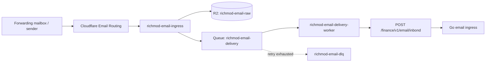

# Cloudflare email ingress runbook

This runbook documents the external Cloudflare resources and delivery contract used by Richmod's production financial-email ingress.

The architecture decision and migration rationale live in [`ADR-033`](../adr/ADR-033-cloudflare-email-ingress-two-deploy-migration.md). This document is the operational setup reference.

## Architecture



Raw RFC822 bytes stay in private R2. Queue messages carry delivery metadata only. The delivery Worker reads the raw object back from R2, recomputes its SHA-256, signs the request, and sends the original MIME bytes to Richmod.

## Production resource map

| Resource | Current name / value | Purpose |
| --- | --- | --- |
| Email domain | `richmod.link` | Generated household recipient domain |
| Email Routing catch-all | `*@richmod.link` | Routes generated addresses to the ingress Worker |
| Ingress Worker | `richmod-email-ingress` | Accepts Email Routing messages, stores raw MIME, publishes metadata |
| R2 bucket | `richmod-email-raw` | Private authoritative raw RFC822 evidence |
| Delivery Queue | `richmod-email-delivery` | Durable delivery metadata between Workers |
| Delivery Worker | `richmod-email-delivery-worker` | Reads R2, signs, and sends MIME to Richmod API |
| Dead-letter Queue | `richmod-email-dlq` | Parks messages after retry exhaustion |
| Richmod endpoint | `https://api.investdx.biz.id/finance/v1/email/inbond` | Machine-to-machine ingress endpoint |

> The endpoint is intentionally spelled `/inbond`. Do not change a Cloudflare variable to `/inbound` unless the Go route changes too.

## Generated recipient contract

Richmod provisions one opaque address per household in this form:

```text
h_<32 lowercase hex>@richmod.link
```

Example shape only:

```text
h_0123456789abcdef0123456789abcdef@richmod.link
```

The recipient is the only email field allowed to select household identity. Sender, subject, body, bank name, Message-ID, object key, and LLM output must never choose or override the household.

The ingress Worker should reject recipients that do not match:

```text
^h_[a-f0-9]{32}@richmod\.link$
```

## Email Routing

Configure Cloudflare Email Routing for `richmod.link` with a catch-all route:

```text
*@richmod.link
  -> Send to Worker
  -> richmod-email-ingress
```

The Worker handles generated addresses dynamically; do not create one Cloudflare route per household.

## R2

Create a private R2 bucket:

```text
richmod-email-raw
```

Bind it to both Workers as:

```text
EMAIL_RAW
```

Raw messages are stored under keys shaped like:

```text
email/YYYY/MM/DD/<uuid>.eml
```

R2 is the authoritative raw-email evidence store for this transport. The PostgreSQL financial state stores references and metadata rather than duplicating the full RFC822 body.

## Main Queue and DLQ

Create:

```text
richmod-email-delivery
richmod-email-dlq
```

Bind `richmod-email-delivery` to the ingress Worker as producer:

```text
EMAIL_DELIVERY_QUEUE
```

Attach `richmod-email-delivery-worker` as the consumer of `richmod-email-delivery`.

Current consumer settings:

| Setting | Value |
| --- | ---: |
| Max batch size | `1` |
| Max wait time | `1s` |
| Max retries | `24` |
| Retry delay | `300s` |
| Max consumer concurrency | `1` |
| Dead-letter Queue | `richmod-email-dlq` |

Leave `richmod-email-dlq` without a consumer. It is an operator-visible parking area, not an automatic retry loop.

When the DLQ contains messages:

1. inspect the failure and the corresponding R2 object;
2. fix the root cause first;
3. replay only after the normal delivery path is healthy;
4. preserve idempotency — replaying an already-ingested payload must not create duplicate financial state.

## Ingress Worker contract

The ingress Worker receives the Cloudflare Email Worker event. For an accepted recipient it should:

1. read the original raw MIME bytes;
2. compute SHA-256 over those exact bytes;
3. write the bytes to `EMAIL_RAW`;
4. publish metadata to `EMAIL_DELIVERY_QUEUE`.

The queue payload currently carries:

```text
objectKey
recipient
envelopeFrom
messageId
subject
date
sha256
rawSize
receivedAt
```

Do not put the full MIME body in Queue messages.

## Delivery Worker bindings

`richmod-email-delivery-worker` needs:

```text
R2 binding
  EMAIL_RAW -> richmod-email-raw

Secret
  RICHMOD_INGRESS_SECRET

Variable
  RICHMOD_INGRESS_URL=https://api.investdx.biz.id/finance/v1/email/inbond
```

`RICHMOD_INGRESS_SECRET` must be the same literal secret string configured as `EMAIL_INGRESS_HMAC_SECRET` in the Richmod API environment.

If the secret was generated as a hex-looking string, both sides use the literal characters as HMAC key bytes. Do not hex-decode on only one side.

Never log either secret.

## HMAC request contract

Before sending, the delivery Worker recomputes the raw MIME SHA-256 and builds this canonical string:

```text
timestamp + "\n" +
recipient + "\n" +
envelopeFrom + "\n" +
sha256
```

Where:

- `timestamp` is Unix seconds;
- `recipient` is the full generated Richmod address;
- `envelopeFrom` is the SMTP envelope sender supplied by Cloudflare;
- `sha256` is lowercase hexadecimal SHA-256 of the exact request body.

Compute HMAC-SHA256 with `RICHMOD_INGRESS_SECRET` and send lowercase hexadecimal output.

The HTTPS request is:

```text
POST /finance/v1/email/inbond
Content-Type: message/rfc822

X-Richmod-Timestamp
X-Richmod-Recipient
X-Richmod-Envelope-From
X-Richmod-Content-SHA256
X-Richmod-Signature
X-Richmod-Message-ID
X-Richmod-Object-Key
```

The body is the unchanged raw RFC822 MIME from R2.

## Delivery acknowledgement policy

The current delivery Worker policy is:

```text
2xx     -> ack
400     -> ack as permanent malformed delivery
other   -> retry
network -> retry
```

R2 object missing or a local SHA mismatch must also retry rather than fabricate or send altered evidence.

Do not acknowledge authentication failures, server failures, or temporary network failures as successful delivery.

## Richmod API environment

The API-side transport configuration is:

```text
EMAIL_INGRESS_HMAC_SECRET=<same literal secret as RICHMOD_INGRESS_SECRET>
EMAIL_INGRESS_DOMAIN=richmod.link
EMAIL_INGRESS_TRUSTED_AUTHSERV_IDS=<production-authserv-id-list>
```

`EMAIL_INGRESS_TRUSTED_AUTHSERV_IDS` is a financial sender-authentication policy, not a Cloudflare transport secret. It must be derived from real forwarded message authentication evidence; do not guess or weaken it to make a sender pass.

A missing trusted-authserv configuration does not block `PROVISIONED` transport/control-message handling, but `ACTIVE` financial delivery fails closed and must not create financial state.

## Address lifecycle

Richmod email ingress addresses have three relevant states:

```text
PROVISIONED
ACTIVE
DISABLED
```

### PROVISIONED

Used while configuring forwarding and proving the transport.

Allowed:

- HMAC/timestamp/SHA verification;
- MIME parsing;
- delivery evidence;
- deterministic setup/control actions such as Gmail forwarding confirmation.

Not allowed:

- financial `source_event`;
- `bank_email_event`;
- `PROCESS_BANK_EMAIL`;
- financial Review Inbox;
- proposal or ledger mutation;
- LLM processing.

### ACTIVE

Financial email may proceed only after trusted authentication evidence passes and the parsed sender matches an active `bank_email_listener` inside the household selected by the signed recipient.

### DISABLED

Old/rotated addresses no longer create financial state.

## Gmail forwarding setup

Gmail is not an application integration anymore; it is only one possible user-controlled forwarding source.

Typical setup:

1. Richmod OWNER provisions an email-ingress address.
2. Address remains `PROVISIONED`.
3. User adds that address in Gmail forwarding settings.
4. Google sends a forwarding confirmation email to the generated Richmod address.
5. The normal Cloudflare transport delivers it.
6. Richmod's deterministic control-email adapter creates an Integration Action.
7. OWNER opens the allowlisted Google verification URL in their browser or uses the confirmation code.
8. User completes Gmail forwarding configuration.
9. Send a real configured financial email while still `PROVISIONED` to inspect authentication evidence if needed.
10. Configure trusted authserv IDs.
11. Activate the Richmod email ingress.

Richmod must never server-side click the Google verification URL.

## Household isolation checks

Before treating the transport as healthy, verify these invariants:

```text
recipient A + valid sender A -> Household A only
recipient B + same sender     -> Household B only
recipient A + listener only B -> ignored, never Household B
recipient tampered A -> B     -> HMAC rejection
unknown recipient             -> generic no-op / no financial mutation
duplicate payload             -> no second source event/job
```

Sender matching must always be constrained by the household resolved from the recipient.

## Smoke test

For a production smoke test:

1. confirm Email Routing points the catch-all to `richmod-email-ingress`;
2. confirm ingress Worker has `EMAIL_RAW` and `EMAIL_DELIVERY_QUEUE` bindings;
3. confirm delivery Worker has `EMAIL_RAW`, `RICHMOD_INGRESS_URL`, and the HMAC secret;
4. confirm `richmod-email-delivery` has the delivery Worker consumer and the DLQ configuration;
5. send a message through the intended forwarding path;
6. verify an `.eml` object appears in `richmod-email-raw`;
7. verify the main Queue drains rather than accumulating retries;
8. verify Richmod records the expected ingress delivery;
9. for `ACTIVE` financial mail, verify exactly one `source_event` / `PROCESS_BANK_EMAIL` path;
10. resend the same evidence and verify idempotency.

Do not use a production financial mutation as a test until the address is intentionally `ACTIVE`.

## Troubleshooting

### Queue keeps retrying

Check, in order:

- `RICHMOD_INGRESS_URL` is exactly `/finance/v1/email/inbond`;
- API is reachable from Cloudflare;
- HMAC secrets match literally;
- timestamp is current;
- body SHA is computed from exactly the bytes sent;
- R2 object exists;
- API logs show whether failure is transport auth, MIME parsing, or application policy.

### Delivery reaches API but financial email is ignored

Transport success is not financial acceptance. Check:

- address status is `ACTIVE`;
- `EMAIL_INGRESS_TRUSTED_AUTHSERV_IDS` is configured from real authentication evidence;
- `Authentication-Results` / ARC evidence is trusted;
- parsed sender exactly matches an active `bank_email_listener` for the resolved household.

Do not bypass sender authentication or household listener matching to make a test pass.

### Gmail confirmation email arrives but no action appears

Check that:

- address is still `PROVISIONED`;
- message sender/subject match the deterministic Gmail forwarding adapter;
- verification URL matches the explicit Google HTTPS host/path allowlist;
- the Integration Action belongs to the same household selected by the generated recipient.

## Security invariants

- The ingress Worker does not hold the backend HMAC secret.
- Only the delivery Worker holds `RICHMOD_INGRESS_SECRET`.
- R2 stays private.
- Raw MIME is never sent to an LLM at the transport boundary.
- Recipient selects household; sender only authorizes processing inside that household.
- Setup/control messages and financial messages use separate application paths.
- Verification URLs are capability-bearing values and must not be logged or exposed to non-OWNER users.
- DLQ replay must use the same idempotent normal delivery path.
- Secrets belong in Cloudflare secrets / production environment, never in the repository.

## Related files

- [`ADR-033: Cloudflare email ingress and two-deploy Gmail sunset`](../adr/ADR-033-cloudflare-email-ingress-two-deploy-migration.md)
- [`apps/api/internal/emailingress`](../../apps/api/internal/emailingress/)
- [`db/migrations/00042_cloudflare_email_ingress.sql`](../../db/migrations/00042_cloudflare_email_ingress.sql)
- [`db/migrations/00043_integration_action_inbox.sql`](../../db/migrations/00043_integration_action_inbox.sql)
- [`db/migrations/00044_gmail_runtime_sunset.sql`](../../db/migrations/00044_gmail_runtime_sunset.sql)
